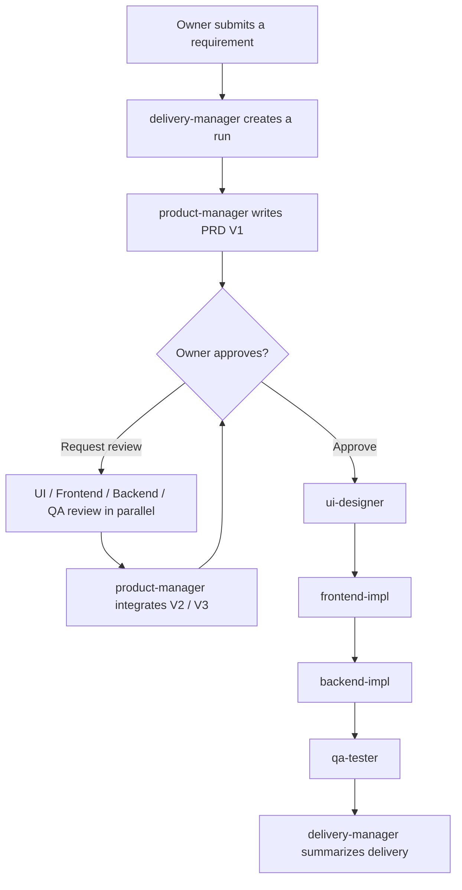

<p align="center">
  
</p>

<h1 align="center">codex-delivery-workflow</h1>

<p align="center">
  Turn one requirement into a coordinated Codex delivery team, with traceable state, shared memory, and versioned artifacts from PRD to QA.
</p>

<p align="center">
  <a href="https://github.com/devTech-zhang/multi-agent-delivery-workflow/stargazers"></a>
  
  
  
  
</p>

<!-- README-I18N:START -->

[简体中文](./README.md) | **English**

<!-- README-I18N:END -->

`codex-delivery-workflow` is a lightweight multi-agent software delivery plugin built for Codex. You are the owner, `delivery-manager` is the manager, and Product, UI, Frontend, Backend, and QA are project agents you can address directly with `@`. The manager can dispatch specialists from natural-language intent and current workflow state, SQLite preserves cross-session state, and files hold the full deliverables.

> [!TIP]
> No separate platform or external service is required. Install the plugin, initialize a project, restart Codex once, and enter `@delivery-manager Build a membership points redemption feature`.

If this project improves your Codex workflow, consider giving it a Star so more builders can find it.

## Why it exists

Multi-agent chats often lose state across sessions. Managers may overstep and write specialist deliverables, workers may claim the same task twice, and important outputs may remain trapped in chat history. This plugin separates collaboration into three reliable layers:

- **Native Codex agents**: initialization writes `.codex/agents/` and `.codex/config.toml`, so an agent can be called directly with `@product-manager` or dispatched by the manager through the matching `agent_type`.
- **Recoverable workflow state**: SQLite stores only runs, jobs, versions, paths, and short summaries. Full content stays in files, balancing reliability with token usage.
- **Delivery-ready artifacts**: PRDs, design specs, implementation results, and QA reports are written to `docs/delivery/` instead of treating chat history as the final output.

## Highlights

- **1 manager + 5 specialist agents**: Product, UI, Frontend, Backend, and QA keep clear ownership boundaries while the manager focuses on orchestration and decisions.
- **Direct `@agent` access or automatic dispatch**: the owner can call a specialist directly, or simply say “continue” and let the manager dispatch the next pending job with `spawn_agent`.
- **Owner approval and multi-role PRD review**: V1 pauses for approval. UI, Frontend, Backend, and QA can review in parallel before Product integrates V2 or V3.
- **Cross-session state and role memory**: every agent shares the same workflow ledger; explicit `@` instances and manager-spawned instances with the same name share one memory file.
- **Versioned artifact archive**: requirements, PRDs, designs, implementation results, and QA reports are stored by run, agent, category, and version.
- **Project isolation**: every business project owns its agent configuration, SQLite database, memory, and artifact directory.
- **Zero third-party Python dependencies**: the MCP server and workflow core use only the Python standard library.

## The agent team

| Role | Identity | Primary responsibility |
| --- | --- | --- |
| Owner | User | Set goals, call agents directly, approve the PRD, and decide whether to continue reviews |
| Manager | `delivery-manager` | Create runs, dispatch specialists, read state, summarize artifacts, and surface blockers |
| Product Manager | `product-manager` | Turn raw requirements into a PRD that can be designed, built, and tested |
| UI Designer | `ui-designer` | Define page structure, layout, components, states, and interaction behavior |
| Frontend Engineer | `frontend-impl` | Implement the frontend, state handling, integration points, and self-checks |
| Backend Engineer | `backend-impl` | Implement APIs, domain models, data structures, permissions, and error handling |
| QA Engineer | `qa-tester` | Define and execute test scope, cases, issue lists, and release recommendations |

## Quick start

### 1. Add the marketplace and install the plugin

```bash
codex plugin marketplace add devTech-zhang/multi-agent-delivery-workflow --ref main
codex plugin add codex-delivery-workflow@devTech-Zhang
```

If the marketplace is already configured, refresh and reinstall the plugin:

```bash
codex plugin marketplace upgrade devTech-Zhang
codex plugin remove codex-delivery-workflow@devTech-Zhang
codex plugin add codex-delivery-workflow@devTech-Zhang
```

### 2. Initialize a target project

```bash
cd /path/to/your-project
codex
```

Enter this in Codex:

```text
Initialize the Codex delivery workflow
```

Initialization creates project agents, registry configuration, the state ledger, role memory, and artifact directories. Trust the project, then fully restart Codex or open a new session so the `@` menu and `spawn_agent` role registry reload.

### 3. Give the manager a goal

```text
@delivery-manager Build a membership points redemption feature
```

You can also call a specialist directly:

```text
@product-manager Turn the current requirement into an acceptance-ready PRD
@ui-designer Review the interaction risks in the current PRD
@backend-impl Review the data model and API boundaries
@qa-tester Add edge-case test scenarios for the latest PRD
```

## Workflow



The manager never replaces a specialist. If the owner explicitly calls an `@agent`, the manager does not dispatch a duplicate. If the owner only says “continue,” the manager reads the current run and pending jobs before spawning the matching custom agent.

## State, memory, and artifacts

The initialized project structure:

```text
.codex/
  config.toml
  agents/
    delivery-manager.toml
    product-manager.toml
    ui-designer.toml
    frontend-impl.toml
    backend-impl.toml
    qa-tester.toml
  delivery-workflow/
    workflow.sqlite3
    logs/
    memory/
      delivery-manager.md
      product-manager.md
      ui-designer.md
      frontend-impl.md
      backend-impl.md
      qa-tester.md
docs/
  delivery/
workflow.config.json
```

| Storage | Contents | Purpose |
| --- | --- | --- |
| `workflow.sqlite3` | Project, run, job, step, artifact, review, event, and memory indexes | Reliable transitions, atomic claims, and cross-session recovery |
| `memory/<agent>.md` | Role conclusions, artifact paths, open questions, and next actions | Shared long-term context for instances with the same agent name |
| `docs/delivery/` | PRDs, design specs, implementation results, and QA reports | Complete, versioned, reviewable deliverables |

> [!NOTE]
> `description` and `developer_instructions` may be written in Chinese, but `nickname_candidates` must use English ASCII. Non-ASCII nicknames may prevent Codex from loading or registering an agent.

## MCP tools

| Intent | Tool |
| --- | --- |
| Initialize a project | `codex_delivery_workflow_init_project` |
| Create a delivery run | `codex_delivery_workflow_create` |
| Read workflow state | `codex_delivery_workflow_status` |
| Prepare an agent task package | `codex_delivery_workflow_prepare_handoff` |
| Claim a pending job | `codex_delivery_workflow_dispatch_next` |
| Record an artifact and advance | `codex_delivery_workflow_complete_agent_step` |
| Summarize as the manager | `codex_delivery_workflow_manager_summary` |
| Approve the PRD | `codex_delivery_workflow_confirm_prd` |
| Start a multi-agent PRD review | `codex_delivery_workflow_request_prd_review` |
| List or read artifacts | `codex_delivery_workflow_list_artifacts` / `codex_delivery_workflow_read_artifact` |
| Inspect the workflow definition | `codex_delivery_workflow_inspect` |

MCP tools accept an explicit `project_root`, so even when the server starts from the plugin cache, state and artifacts are written to the active Codex project rather than the plugin directory.

## Local development and validation

Python 3.11 or newer is required. There are no third-party dependencies.

```bash
python3 -m delivery_workflow.cli config init
python3 -m delivery_workflow.cli project create \
  --title "TODO Web" \
  --requirement "Build a minimal TODO web app"
python3 -m delivery_workflow.cli project status
```

```bash
python3 -m unittest tests.test_core
python3 -m compileall -q delivery_workflow
git diff --check
```

## Current scope

The current release focuses on a lightweight Codex-native delivery loop: project agents, manager-led dispatch, PRD review, a thin state ledger, shared role memory, and file-based artifacts. It intentionally excludes Feishu, external approvals, cross-platform adapters, complex release pipelines, and unattended production deployment.
