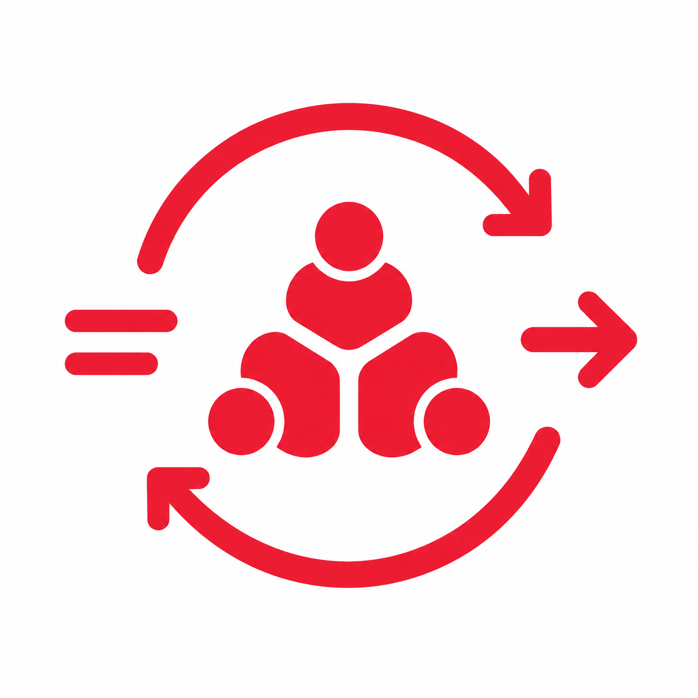
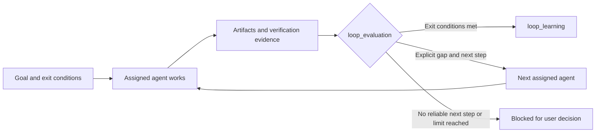

<p align="center">
  
</p>

<h1 align="center">codex-multi-agents-loop</h1>

<p align="center">
  <strong>Give Codex an engineering team that knows when work is actually done.</strong>
</p>

<p align="center">
  <a href="https://github.com/devTech-zhang/codex-multi-agents-loop/stargazers"></a>
  
  
  
</p>

<!-- README-I18N:START -->

[中文](./README.md) | **English**

<!-- README-I18N:END -->

`codex-multi-agents-loop` is a Codex plugin for software projects. It turns product, architecture, UI, engineering, and QA into directly mentionable project agents, then combines durable state, evidence-based evaluation, and bounded iterations to turn “every agent says it is done” into a goal that is demonstrably complete.

> [!TIP]
> Do not start a full workflow for a one-line bug fix. Mention `@development-engineer` directly. Bring in `@project-manager` when product, architecture, and engineering need to work through a decision together. The goal selects the workflow, not a rigid role sequence.

## Why install it

The usual failure mode in multi-agent work is not a lack of capability. It is a lack of trustworthy completion: work gets lost in chat history, managers write specialist deliverables, agents duplicate ownership, and an unverified change is called finished.

This plugin makes collaboration follow three simple rules:

- **Roles have boundaries**: PM owns planning, dispatch, risk, and decision points; each specialist owns its own deliverables.
- **Completion needs evidence**: agents return structured `loop_evaluation` data with exit conditions, missing evidence, and the recommended next agent.
- **Loops are bounded**: the system continues only when an agent explicitly supplies a valid next step. The default maximum is three iterations, so retries do not run forever.

When a task finishes, `loop_learning` captures its goal, artifacts, correction path, and reusable lessons inside the project instead of leaving them in a transient chat.

## What you get

| Role | Agent | Owns |
| --- | --- | --- |
| Project Manager | `project-manager` | Task routing, status summaries, risk, next steps, and user decisions |
| Product Manager | `product-manager` | `PRODUCT.md`, product handoffs, scope, and acceptance criteria |
| Software Architect | `software-architect` | `AGENTS.md`, technical design, module boundaries, and task breakdowns |
| UI Designer | `ui-designer` | `DESIGN.md`, visual rules, state coverage, and UI acceptance points |
| Development Engineer | `development-engineer` | Stack-appropriate implementation, self-checks, and engineering reports |
| QA Engineer | `qa-engineer` | Test evidence, risk levels, and release recommendations |

The PM can dispatch these agents, or you can mention them directly. They share an SQLite state ledger, project-local memory, and versioned artifacts, so a fresh session can recover the task context.

## Start in two minutes

You need Codex and Python 3.11+.

```bash
codex plugin marketplace add devTech-zhang/codex-multi-agents-loop --ref main
codex plugin add codex-multi-agents-loop@devTech-Zhang
```

Open Codex at the root of the project you want to work on, then ask the PM to initialize the control area:

```text
@project-manager initialize the multi-agent Loop for this project
```

Initialization creates only agent registration, state, artifacts, logs, and memory under `.codex/`. Project source, business documents, and configuration always remain in the project root beside `.codex/`.

Open a new Codex session and the project agents will appear in the `@` menu.

## Choose the collaboration mode that fits

| Goal | Recommended mode | Example |
| --- | --- | --- |
| One clearly owned change | Mention a single agent directly | `@development-engineer fix the login timeout in this project` |
| Two or more specialist perspectives | Name the participating agents | `@project-manager have product and architecture review the payment redesign together` |
| A large or unclear requirement | Let the PM create a full task | `@project-manager build team invitations and take it to verifiable delivery` |

After product confirmation, a full task progresses through architecture, UI, engineering, and QA when those roles are needed. A directed task ends as soon as its declared agents finish and no work is pending or running; it is never forced into the full chain.

## How the loop works



Automatic iteration reads only structured `metadata.loop_evaluation`; it never guesses who should continue from natural-language prose. A typical result looks like this:

```json
{
  "loop_evaluation": {
    "exit_conditions_met": false,
    "missing_evidence": ["Verification result after refreshing the login verification code"],
    "next_agent": "qa-engineer",
    "next_target": "Verify button state after the verification code refreshes",
    "reason": "The fix is implemented, but test evidence is missing"
  }
}
```

## Where artifacts and state live

```text
.codex/
├── config.toml
├── agents/
└── multi-agents-loop/
    ├── config.json
    ├── workflow.sqlite3
    ├── memory/
    ├── runs/
    └── scratch/
```

SQLite stores runs, jobs, events, artifact paths, and short summaries. Complete reports are artifacts under `runs/`. Global-memory sync is explicit; context from one project is never written automatically into another.

## UI design delivery standard

`ui-designer` uses the plugin's built-in `DESIGN.md` standard. Design tokens need evidence from code, design files, snapshots, specifications, or user confirmation; unknown details are explicitly marked as `locked`, `inferred`, or `open`.

`DESIGN.md` always contains Overview, Colors, Typography, Elevation, Components, and Do's and Don'ts. It captures an implementable visual system, interaction states, and acceptance points rather than turning an engineering process into a design document.

## Common commands

```bash
# Inspect configured marketplaces and available plugins
codex plugin marketplace list
codex plugin list

# Refresh the public marketplace snapshot, then install it again
codex plugin marketplace upgrade devTech-Zhang
codex plugin add codex-multi-agents-loop@devTech-Zhang

# Validate the plugin before development or publishing
PYTHONDONTWRITEBYTECODE=1 python3 -m unittest discover -s tests -v
```

Use the version script to synchronize the plugin manifest, Python package, and workflow definition:

```bash
python3 scripts/upgrade-version.py patch
python3 scripts/upgrade-version.py patch --install --marketplace <marketplace-name>
```

## Fit and boundaries

This plugin fits software projects that need traceable collaboration, cross-session recovery, and engineering-grade delivery. It is not a good fit for a one-off question with no artifacts or verification needs.

The plugin does not invent business truth. When input is incomplete, exit conditions are unclear, or trade-offs need to be made, it keeps the gap visible and hands the decision back to the user. That boundary is what keeps automation controllable.
