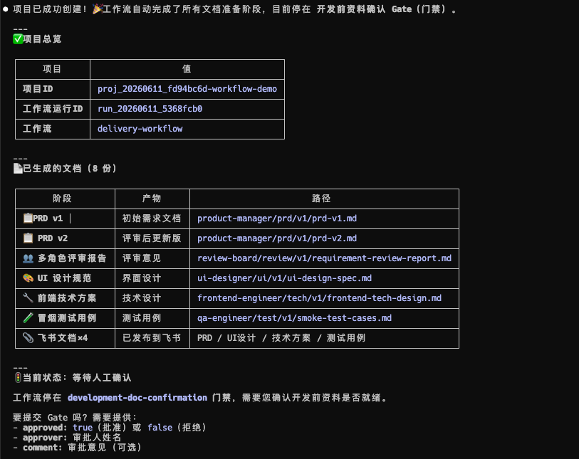
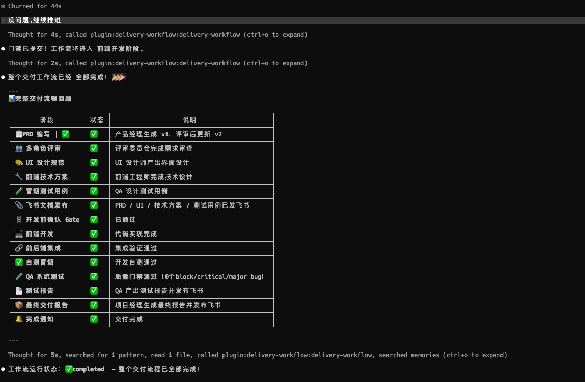
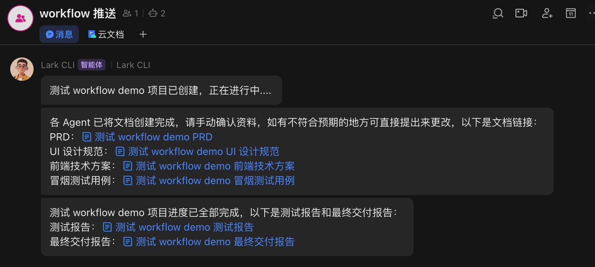

<p align="center">
  
</p>

# Delivery Workflow

通用软件交付 Workflow Worker 与多 Agent 编排插件。它把需求、PRD、评审、设计、开发、测试、缺陷修复和最终交付报告组织成一个可追踪、可恢复、可审计的本地项目流程。

<!-- README-I18N:START -->

**简体中文** | [English](./README.en.md)

<!-- README-I18N:END -->

> [!NOTE]
> 当前支持 Codex 和 Claude Code。每个业务目录就是一个独立项目，workflow 状态、资料和源码都落在当前目录内。

## 效果预览

### Claude Code 工作流推进





### 飞书文档归档



## 为什么需要它

AI Agent 擅长生成内容，但软件交付还需要确定性的状态流转、人工确认边界、产物归档和质量准出。Delivery Workflow 让 Agent 负责“理解、生成、执行”，让 Workflow Worker 负责“状态、证据、Gate 和质量门禁”。

- 文件化流程：`delivery_workflow/workflow.yaml` 是唯一流程定义源。
- 项目级状态：SQLite 保存 run、job、gate、event，文件系统保存 artifact。
- 开发前确认：PRD、UI 规范、技术方案和冒烟用例发布到飞书后，流程停在开发前资料确认 Gate。
- 真实质量门禁：QA 系统测试或回归测试未达标则进入 bug-fix，再回归，直到满足阈值。
- 飞书归档：飞书只依赖本机 `lark-cli` 配置。
- 宿主 hooks：记录文件写入、命令执行和 Stop 事件，为“是否真实执行自测/测试”提供 evidence。

## 工作流概览

```text
PRD v1
  -> 多角色需求评审
  -> 最终 PRD
  -> UI 设计规范
  -> 前端技术方案
  -> 后端技术方案（不需要后端时跳过）
  -> QA 生成冒烟测试用例
  -> 发布飞书资料并打开开发前资料确认 Gate
  -> 前端开发
  -> 后端开发（不需要后端时跳过）
  -> 前后端联调
  -> 前后端开发冒烟自测
  -> QA 系统测试
  -> bug-fix <-> QA 回归测试
  -> QA 生成测试报告
  -> 最终交付报告
```

默认质量门禁：

| 等级     | 默认阈值 |
| -------- | -------- |
| Block    | 0        |
| Critical | 0        |
| Major    | <= 2     |
| Minor    | <= 5     |

## 项目结构

仓库结构：

```text
.
├── .codex-plugin/
├── .claude-plugin/
├── hooks/
├── delivery_workflow/
├── skills/delivery-workflow/
├── tests/
├── delivery-workflow.config.json
└── pyproject.toml
```

业务项目初始化后生成：

```text
.delivery-workflow/
  delivery.db
  logs/
delivery-project/
source-code/
workflow.config.json
```

## 快速开始

### Codex CLI

```bash
codex plugin marketplace add https://github.com/devTech-zhang/multi-agent-delivery-workflow.git --ref main
codex plugin add delivery-workflow@devTech-Zhang
codex plugin list | grep delivery-workflow
```

更新：

```bash
codex plugin marketplace upgrade delivery-workflow-marketplace
codex plugin add delivery-workflow@devTech-Zhang
```

### Claude Code CLI

```bash
claude plugin marketplace add https://github.com/devTech-zhang/multi-agent-delivery-workflow.git#main
claude plugin install delivery-workflow@devTech-Zhang
claude plugin marketplace list
claude plugin list
```

更新：

```bash
claude plugin marketplace update delivery-workflow-marketplace
claude plugin update delivery-workflow@devTech-Zhang
```

### 初始化并创建项目

进入业务项目目录后，直接让 AI 调用插件工具：

```text
初始化项目配置。
新建项目：做一个 TODO H5 应用，支持新增、完成、删除和本地持久化。
```

默认会推进到“开发前资料确认 Gate”。你检查飞书文档里的 PRD、UI 规范、技术方案和冒烟用例后，再让 AI 继续推进开发；如果文档有问题，直接说明要改哪里，workflow 会回到文档修订阶段。

## MCP 工具

| 用户意图              | MCP 工具                                             |
| --------------------- | ---------------------------------------------------- |
| 初始化当前项目配置    | `delivery_init_project_config`                       |
| 新建交付项目          | `delivery_create_project`                            |
| 查询此项目状态        | `delivery_get_current_project_status`                |
| 删除此项目并备份      | `delivery_delete_current_project`                    |
| 推进一个 worker job   | `delivery_worker_once`                               |
| 推进到阻塞/空闲/失败  | `delivery_worker_until_blocked`                      |
| 等待 Gate 提交后稳定  | `delivery_watch_run`                                 |
| 触发人工 bug 修复流程 | `delivery_request_bug_fix`                           |
| 查看 artifact         | `delivery_list_artifacts` / `delivery_read_artifact` |

## 配置

项目读取当前目录的 `workflow.config.json`。`config init` 会把插件默认配置复制到业务项目目录。

飞书配置支持：

```json
{
    "lark": {
        "enabled": true,
        "identity": "bot",
        "chat_id": "oc_xxx"
    }
}
```

- `enabled=true`：创建飞书文档。
- `enabled=false`：跳过飞书动作，只保留本地 artifact。
- `identity`：传给 `lark-cli --as`，可选 `bot` 或 `user`。
- `chat_id`：可选，项目群 ID；默认模板为空，业务项目可按需填写。

如果创建项目时同时传入 `lark_chat_id` / `--lark-chat-id`，会优先使用创建参数。例如 CLI 方式：

```bash
python3 -m delivery_workflow.cli project create \
  --title "TODO H5" \
  --requirement "做一个 TODO H5 应用" \
  --lark-chat-id "oc_xxx"
```

飞书凭证完全由本机 `lark-cli` 管理：

```bash
npx @larksuite/cli@latest install
lark-cli config init --new
lark-cli auth login --recommend
lark-cli auth status
```

## 飞书资料发布

开发前会发布这些文档：

- `{项目名} PRD`
- `{项目名} UI 设计规范`
- `{项目名} 前端技术方案`
- `{项目名} 后端技术方案`（不需要后端时跳过）
- `{项目名} 冒烟测试用例`

后续还会发布：

- `{项目名} 测试报告`
- `{项目名} 最终交付报告`

文档内容会先整理成 XML 再通过 `lark-cli docs +create --content @file --doc-format xml` 创建，避免长正文或表格格式在命令参数里损坏。

群消息只发送三个阶段：

- `{项目名} 项目已创建，正在进行中....`
- 开发前资料全部创建完成后，汇总发送 PRD、UI 设计规范、技术方案和冒烟测试用例链接。
- 项目完成后，汇总发送测试报告和最终交付报告链接。

## 宿主 Hooks

插件提供 Claude Code / Codex 宿主 hooks，用于记录真实执行证据，不自动推进 workflow：

| Hook                               | 作用                                                                 |
| ---------------------------------- | -------------------------------------------------------------------- |
| `PreToolUse Bash`                  | 拦截明显危险命令和可能泄露 secret 的命令                             |
| `PostToolUse Write/Edit/MultiEdit` | 记录 Agent 实际写入的文件                                            |
| `PostToolUse Bash`                 | 记录实际执行的命令，并归类为安装、构建、测试、Playwright、API 检查等 |
| `Stop`                             | 记录一轮 Agent 响应结束                                              |

Evidence 写入：

```text
.delivery-workflow/logs/host-hooks.jsonl
.delivery-workflow/logs/workflow.log
```

## 开发与验证

```bash
python3 -m unittest tests.test_core
python3 -m compileall delivery_workflow
git diff --check
```

## 设计原则

- Agent 只生成内容和执行任务，不直接改 workflow state。
- Workflow Worker 负责状态机、Gate、入队、产物归档和质量门禁。
- 每个步骤只读取 `workflow.yaml` 声明的输入 artifact。
- 所有关键产物都写入 `delivery-project/`。
- 前后端源码写入 `source-code/`，前后端分离。
- 真实自测和 QA 结果必须可追踪，不把“任务包已准备”伪装成“已完成”。
