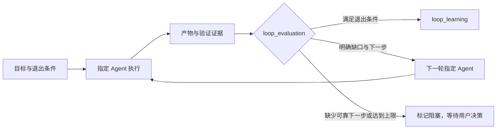

<p align="center">
  
</p>

<h1 align="center">codex-multi-agents-loop</h1>

<p align="center">
  <strong>给 Codex 一支会判断“现在是否真的完成”的工程团队。</strong>
</p>

<p align="center">
  <a href="https://github.com/devTech-zhang/codex-multi-agents-loop/stargazers"></a>
  
  
  
</p>

<!-- README-I18N:START -->

**中文** | [English](./README.en.md)

<!-- README-I18N:END -->

`codex-multi-agents-loop` 是一个面向软件项目的 Codex 插件。它把产品、架构、UI、研发和测试变成可以直接 `@` 的项目 Agent，同时用持久化状态、证据型评估和有上限的迭代，让协作从“每个 Agent 都说做完了”变成“目标有证据地完成”。

> [!TIP]
> 不必为了一个 Bug 修复启动完整流程。直接 `@development-engineer`；需要产品、架构与研发共同判断时再 `@project-manager`。流程由任务目标决定，不由固定角色顺序决定。

## 为什么值得安装

多 Agent 协作常见的失控点不是能力不够，而是没有可靠的结束条件：任务散在聊天记录中，PM 越界代写专业产物，多个 Agent 重复处理同一件事，验证缺失却被宣告完成。

这个插件把协作收敛为三条简单规则：

- **角色有边界**：PM 只负责计划、调度、风险与决策点；专业产物归对应角色所有。
- **完成要有证据**：Agent 回填结构化 `loop_evaluation`，明确退出条件、缺失证据与建议的下一位 Agent。
- **循环有上限**：只有 Agent 明确提出合法的下一步，系统才会自动进入下一轮；默认最多 3 轮，避免无限重试。

任务结束时会写入 `loop_learning`，把本次目标、产物、修正路径与可复用经验留在项目内，而不是让经验消失在一次聊天中。

## 你会得到什么

| 角色 | Agent | 负责的交付 |
| --- | --- | --- |
| 项目经理 | `project-manager` | 任务路由、状态摘要、风险、下一步与用户决策点 |
| 产品经理 | `product-manager` | `PRODUCT.md`、产品交接说明、范围与验收标准 |
| 架构师 | `software-architect` | `AGENTS.md`、技术设计、模块边界、任务拆解 |
| UI 设计师 | `ui-designer` | `DESIGN.md`、视觉规范、状态覆盖、UI 验收点 |
| 研发工程师 | `development-engineer` | 与项目技术栈匹配的实现、自测与研发报告 |
| 测试工程师 | `qa-engineer` | 测试证据、风险分级与准入建议 |

这些 Agent 既能由 PM 调度，也能被你直接点名。它们共用 SQLite 状态账本、项目内记忆和版本化产物，因此新开会话后仍能恢复任务上下文。

## 两分钟开始

需要 Codex 和 Python 3.11+。

```bash
codex plugin marketplace add devTech-zhang/codex-multi-agents-loop --ref main
codex plugin add codex-multi-agents-loop@devTech-Zhang
```

在要协作的项目根目录打开 Codex，然后让 PM 初始化控制区：

```text
@project-manager 初始化当前项目的多 Agent Loop
```

初始化只会创建 `.codex/` 下的 Agent 注册、状态、产物、日志与记忆；项目源码、业务文档和配置始终位于项目根目录，与 `.codex` 同级。

新开一个 Codex 会话后，项目 Agent 会出现在 `@` 菜单中。

## 选择适合你的协作方式

| 目标 | 推荐方式 | 例子 |
| --- | --- | --- |
| 一个职责明确的改动 | 直接 @ 单个 Agent | `@development-engineer 修复当前项目登录超时` |
| 需要两个或多个专业视角 | 指定多个 Agent 协作 | `@project-manager 让产品经理和架构师一起评审支付改造` |
| 范围大或仍不清晰的需求 | 由 PM 创建完整任务 | `@project-manager 实现团队邀请功能，并推进到可验证交付` |

完整任务会在产品确认后按需要推进架构、UI、研发和 QA。定向任务在已声明的 Agent 完成、且没有待办或运行任务时直接结束，不会被强行拉入完整链路。

## 闭环如何工作



自动迭代只读取结构化 `metadata.loop_evaluation`，不会从自然语言中猜测“应该让谁继续”。一个典型回填如下：

```json
{
  "loop_evaluation": {
    "exit_conditions_met": false,
    "missing_evidence": ["登录验证码刷新后的验证结果"],
    "next_agent": "qa-engineer",
    "next_target": "验证验证码刷新后按钮状态",
    "reason": "修复已完成，但缺少测试证据"
  }
}
```

## 产物与状态在哪里

```text
.codex/
├── config.toml
├── agents/
└── multi-agents-loop/
    ├── config.json
    ├── workflow.sqlite3
    ├── memory/
    ├── runs/
    └── scratch/
```

SQLite 保存 run、job、事件、产物路径和短摘要；完整报告以 artifact 文件保存在 `runs/`。全局记忆同步是显式操作，不会把一个项目的上下文自动写进其他项目。

## UI 设计交付标准

`ui-designer` 使用插件内置的 `DESIGN.md` 标准。设计 token 必须有代码、设计稿、快照、规范或用户确认作为证据；未知项明确区分为 `locked`、`inferred` 与 `open`。

`DESIGN.md` 固定包含 Overview、Colors、Typography、Elevation、Components、Do's and Don'ts 六个部分，覆盖可实现的视觉系统、交互状态与验收点，而不是把工程流程塞进设计文档。

## 常用命令

```bash
# 查看已配置的插件市场和可安装插件
codex plugin marketplace list
codex plugin list

# 拉取公开仓库最新市场快照后重新安装
codex plugin marketplace upgrade devTech-Zhang
codex plugin add codex-multi-agents-loop@devTech-Zhang

# 开发或发布前验证插件
PYTHONDONTWRITEBYTECODE=1 python3 -m unittest discover -s tests -v
```

维护版本时，使用脚本同步插件清单、Python 包和工作流定义中的版本号：

```bash
python3 scripts/upgrade-version.py patch
python3 scripts/upgrade-version.py patch --install --marketplace <marketplace-name>
```

## 适用边界

它适合需要可追溯协作、跨会话恢复和工程化交付的软件项目；不适合只有一次性问答、无需产物或无需验证的小请求。

插件不会替你判断业务真相：材料不足、退出条件不清或需要取舍时，它会保留缺口并交给用户决策。正是这条边界，让自动协作保持可控。
