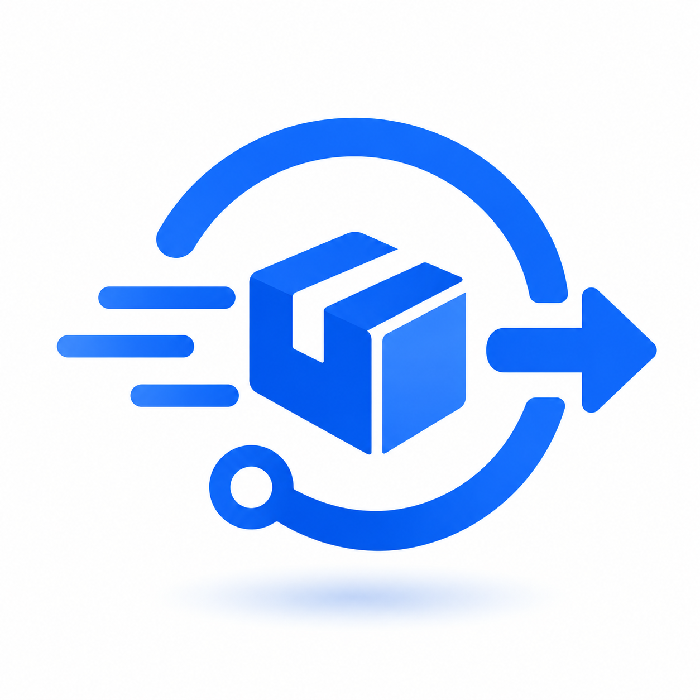
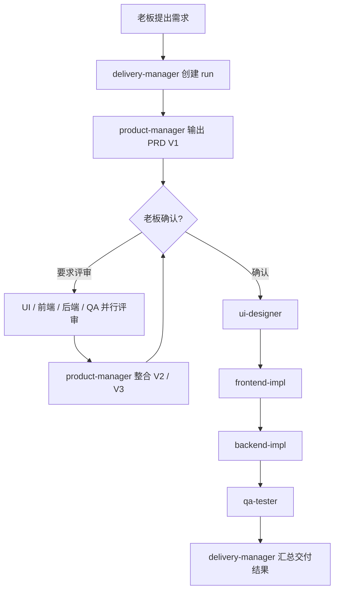

<p align="center">
  
</p>

<h1 align="center">codex-delivery-workflow</h1>

<p align="center">
  把一句需求交给一支 Codex 原生 Agent 团队，从 PRD、设计、开发到测试持续推进，并让每一步都有状态、有记忆、有产物。
</p>

<p align="center">
  <a href="https://github.com/devTech-zhang/multi-agent-delivery-workflow/stargazers"></a>
  
  
  
  
</p>

<!-- README-I18N:START -->

**简体中文** | [English](./README.en.md)

<!-- README-I18N:END -->

`codex-delivery-workflow` 是一个为 Codex 设计的轻量多 Agent 软件交付插件。用户是老板，`delivery-manager` 是主管，产品、UI、前端、后端和 QA 是可直接 `@` 的项目级员工。主管能根据自然语言和当前状态主动调度员工，SQLite 负责跨会话状态，文件负责保存完整产物。

> [!TIP]
> 不需要搭建独立平台，也不依赖外部服务。安装插件、初始化项目、重启一次 Codex，就可以输入 `@delivery-manager 实现一个会员积分兑换需求` 开始工作。

如果这个项目对你的 Codex 工作流有帮助，欢迎点一个 Star，让更多人看到它。

## 为什么需要它

普通多 Agent 对话很容易在会话切换后丢失状态，也容易出现主管越权写 PRD、员工重复领取任务、产物只存在聊天记录里的问题。这个插件把协作拆成三个稳定层次：

- **Codex 原生 Agent**：初始化后写入 `.codex/agents/` 和 `.codex/config.toml`，既能被用户直接 `@product-manager`，也能被主管以同名 `agent_type` 调度。
- **可恢复的流程状态**：SQLite 只保存 run、job、版本、路径和短摘要，完整内容落盘，兼顾稳定性和 token 消耗。
- **可交付的文件产物**：PRD、设计规范、前后端结果和测试报告统一进入 `docs/delivery/`，不把聊天历史当作最终交付物。

## 功能亮点

- **1 名主管 + 5 名专业 Agent**：产品、UI、前端、后端、QA 各守职责边界，主管只调度、归纳和推动决策。
- **直接 `@agent` 或自动调度**：老板可以直接找员工，也可以只说“继续下一步”，由主管结合 pending job 主动 `spawn_agent`。
- **PRD 人工确认与多角色评审**：V1 先交老板确认；不满意时由 UI、前端、后端、QA 并行评审，产品经理整合为 V2/V3。
- **跨会话共享状态与角色记忆**：所有 Agent 共享同一份状态账本；同名 Agent 的显式 `@` 实例和主管调度实例共享同一个 memory 文件。
- **版本化产物归档**：每个 run 的需求、PRD、设计、实现和 QA 结果按 Agent、类别和版本保存，随时可以追溯。
- **项目隔离**：每个业务项目拥有自己的 Agent 配置、SQLite、memory 和产物目录，不污染其他项目。
- **零第三方 Python 依赖**：MCP Server 和工作流内核仅使用 Python 标准库，安装面和维护成本都很小。

## Agent 团队

| 角色 | 身份 | 主要职责 |
| --- | --- | --- |
| 老板 | 用户 | 提出目标、直接点名 Agent、确认 PRD、决定是否继续评审 |
| 主管 | `delivery-manager` | 创建 run、调度员工、读取状态、归纳产物、暴露阻塞点 |
| 产品经理 | `product-manager` | 把原始需求整理成可设计、可开发、可测试的 PRD |
| UI 设计师 | `ui-designer` | 输出页面结构、布局、组件、状态和交互规范 |
| 前端工程师 | `frontend-impl` | 完成前端实现、状态处理、联调点和自测说明 |
| 后端工程师 | `backend-impl` | 完成接口、领域模型、数据结构、权限和错误处理 |
| QA 工程师 | `qa-tester` | 生成并执行测试范围、用例、问题清单和准入建议 |

## 快速开始

### 1. 添加 Marketplace 并安装插件

```bash
codex plugin marketplace add devTech-zhang/multi-agent-delivery-workflow --ref main
codex plugin add codex-delivery-workflow@devTech-Zhang
```

已经添加过 Marketplace 时，更新并重装插件：

```bash
codex plugin marketplace upgrade devTech-Zhang
codex plugin remove codex-delivery-workflow@devTech-Zhang
codex plugin add codex-delivery-workflow@devTech-Zhang
```

### 2. 在目标项目中初始化

```bash
cd /path/to/your-project
codex
```

在 Codex 中输入：

```text
初始化 Codex 交付工作流
```

初始化会创建项目级 Agent、注册配置、状态账本、角色记忆和产物目录。请信任当前项目，然后完全重启或新开 Codex 会话，让 `@` 菜单和 `spawn_agent` role registry 重新加载。

### 3. 交给主管推进

```text
@delivery-manager 实现一个会员积分兑换需求
```

也可以直接找某个专业 Agent：

```text
@product-manager 把当前需求补充成可验收的 PRD
@ui-designer 评审当前 PRD 的交互风险
@backend-impl 检查数据模型和接口边界
@qa-tester 根据最新 PRD 补充异常场景用例
```

## 工作流



主管不会代替员工产出专业内容。老板已显式 `@agent` 时，主管不重复调度；老板只说“继续下一步”时，主管会读取当前 run 和 pending job，再调用对应的自定义 Agent。

## 状态、记忆与产物

初始化后的项目结构：

```text
.codex/
  config.toml
  agents/
    delivery-manager.toml
    product-manager.toml
    ui-designer.toml
    frontend-impl.toml
    backend-impl.toml
    qa-tester.toml
  delivery-workflow/
    workflow.sqlite3
    logs/
    memory/
      delivery-manager.md
      product-manager.md
      ui-designer.md
      frontend-impl.md
      backend-impl.md
      qa-tester.md
docs/
  delivery/
workflow.config.json
```

| 存储 | 保存内容 | 设计目的 |
| --- | --- | --- |
| `workflow.sqlite3` | project、run、job、step、artifact、review、event、memory 索引 | 稳定流转、并发领取、跨会话恢复 |
| `memory/<agent>.md` | 角色结论、产物路径、未决问题、下一步 | 让同名 Agent 实例共享长期上下文 |
| `docs/delivery/` | PRD、设计规范、实现结果、QA 报告 | 保存完整、可版本化、可审阅的交付物 |

> [!NOTE]
> `description` 和 `developer_instructions` 可以使用中文；`nickname_candidates` 必须使用英文 ASCII，否则 Codex 可能无法加载或注册 Agent。

## MCP 工具

| 意图 | 工具 |
| --- | --- |
| 初始化项目 | `codex_delivery_workflow_init_project` |
| 创建大任务 | `codex_delivery_workflow_create` |
| 查询状态 | `codex_delivery_workflow_status` |
| 准备 Agent 任务包 | `codex_delivery_workflow_prepare_handoff` |
| 领取待办 | `codex_delivery_workflow_dispatch_next` |
| 回填产物 | `codex_delivery_workflow_complete_agent_step` |
| 主管汇总 | `codex_delivery_workflow_manager_summary` |
| 确认 PRD | `codex_delivery_workflow_confirm_prd` |
| 发起多 Agent 评审 | `codex_delivery_workflow_request_prd_review` |
| 列出或读取产物 | `codex_delivery_workflow_list_artifacts` / `codex_delivery_workflow_read_artifact` |
| 查看工作流定义 | `codex_delivery_workflow_inspect` |

MCP 工具支持显式传入 `project_root`，因此即使 Server 从插件缓存目录启动，也会把状态和产物写入当前 Codex 项目，而不是插件目录。

## 本地开发与验证

要求 Python 3.11 或更高版本，无第三方依赖。

```bash
python3 -m delivery_workflow.cli config init
python3 -m delivery_workflow.cli project create \
  --title "TODO Web" \
  --requirement "做一个极简 TODO Web 应用"
python3 -m delivery_workflow.cli project status
```

```bash
python3 -m unittest tests.test_core
python3 -m compileall -q delivery_workflow
git diff --check
```

## 当前范围

当前版本专注验证 Codex 内的轻量多 Agent 交付闭环：项目级 Agent、主管调度、PRD 评审、薄状态账本、共享记忆和文件产物。暂不包含飞书、外部审批、跨平台适配、复杂发布流水线和无人值守的全自动上线。
